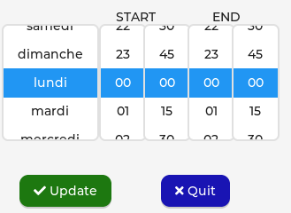
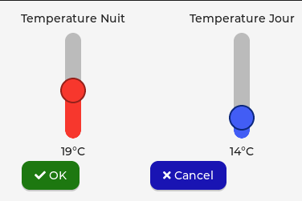

# CONNECTED THERMOSTAT
Project based on AZ Delivery Touch ili9371 + xpt2046 display &amp; ESP32 board

## Dependencies

### Firmware

The firmware is built using [lvgl & microptyhon](https://github.com/lvgl/lv_micropython)
* Follow the instructions to clone the repositories & compile the initial firmware
* Before compiling, copy with recursive option this local lv_micropython over the cloned lv_micropython the
    * This will enable the embedding of the Monteserrat font with a few font sizes
    * It also embeds additional Font Awesome symbols used by this project
* If you don't want to compile yourself the firmware, execute the [flashFW](./firmware/flashFW.sh) command

### Libraries

* mqtt.simple2
* DHT22

### screen shots

